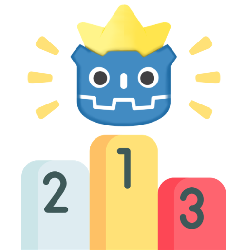
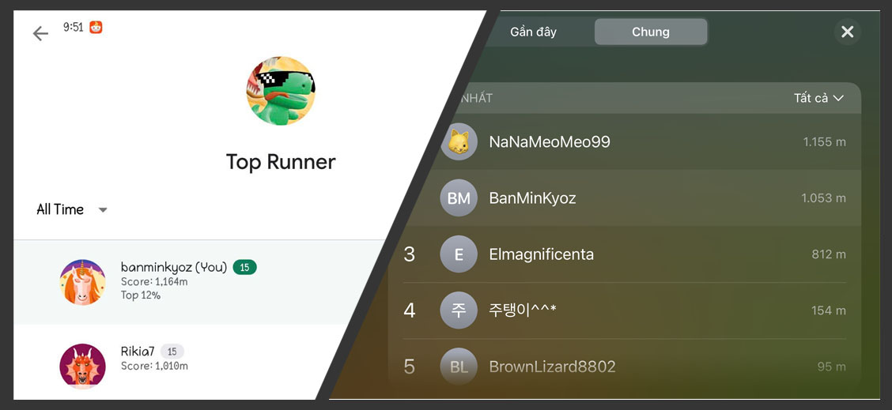

<h1 align="center">
  <br>
  
  <br>
  Godot Leaderboard
  <br>
</h1>

<h4 align="center">Godot plugin to request Leaderboard on Android/iOS. Supports Godot 3 & 4</a>.</h4>

<p align="center">
  <a href="https://github.com/kyoz/godot-leaderboard/releases">
    
  </a>
  <span>&nbsp</span>
  <a href="https://github.com/kyoz/godot-leaderboard/actions">
    
  </a>
  <span>&nbsp</span>
  <a href="https://github.com/kyoz/godot-leaderboard/releases">
    
  </a>
  <span>&nbsp</span>
  
  <span>&nbsp</span>
  
</p>

<p align="center">
  <a href="#about">About</a> •
  <a href="#installation">Installation</a> •
  <a href="#usage">Usage</a> •
  <a href="#api">API</a> •
  <a href="#notes">Notes</a> •
  <a href="#contribute">Contribute</a> •
  <a href="https://github.com/kyoz/godot-leaderboard/releases">Downloads</a> 
</p>

<p align="center">
  
</p>

# About

This plugin helps you to easy implement simple Leaderboard on your mobile game (Android/iOS).

Built using automation scripts combined with CI/CD to help speed up the release progress as well as the release of hotfixes which save some of our time.

Supports Godot 3 & 4.

# Installation

## Android

Follow this [instruction](https://developer.android.com/games/pgs/console/setup) to setup Play Game Services, also [create your leaderboard](https://developer.android.com/games/pgs/leaderboards#:~:text=To%20create%20a%20leaderboard%20for,click%20the%20Create%20leaderboard%20button.&text=Then%2C%20simply%20fill%20out%20the%20information%20required%20for%20this%20leaderboard.) on Play Console

Download the [Android plugin](https://github.com/kyoz/godot-leaderboard/releases) (match your Godot version), and extract them to `your_project/android/plugins`

Enable `Leaderboard` plugin in your Android export preset.

*Note*: You must [use custom build](https://docs.godotengine.org/en/stable/tutorials/export/android_custom_build.html) for Android to use plugins.

## iOS

Create your leaderboard on App Store Connect (this is really easy)

Download the [iOS plugin](https://github.com/kyoz/godot-leaderboard/releases) (match your Godot version), and extract them to `ios/plugins`

Enable `Leaderboard` plugin in your iOS export preset.

> **IMPORTANT**: You have to add `Game Center` Capability in your Xcode Project or else the Leaderboard feature will not work

# Usage

An `autoload` script is provided for easier use of this plugin.

Download [autoload file](./autoload) (match your Godot version). Add it to your project `autoload` list.

Then you can easily use the plugin anywhere with:

```gdscript
Leaderboard.signIn()
Leaderboard.fetchHighScore(leaderboard_id)
Leaderboard.submitHighScore(leaderboard_id, highscore)
...

# Godot 3
Leaderboard.connect("on_authenticated", self, "_on_authenticated")
Leaderboard.connect("on_leaderboard_event", self, "_on_leaderboard_event")

# Godot 4
Leaderboard.on_authenticated.connect(_on_authenticated)
Leaderboard.on_leaderboard_event.connect(_on_leaderboard_event)
```

"Why do I have to call `init()`?"  

Well, if you don't want to, you can change `init()` to `_ready()` on the `autoload` file. But in my experience, when using a lot of plugins, initializing all plugins on `_ready()` is not a good idea. This way, you can choose whenever to initialize the plugin e.g. when showing a loading scene, etc.

For more detail, see [examples](./example/)

# API

## Methods

```gdscript
bool check_authenticated() # Check current authenticated status

void signIn() # Sign in (Shoud use `check_authenticated` to check before signIn)

void fetchHighScore(leaderboard_id: String) # Fetch user highscore (must signed in)

void submitHighScore(leaderboard_id: String, score: int) # Submit user highscore (must signed in)

void show(leaderboard_id: String) # Show leaderboard
```

## Signals

```gdscript
signal on_error(error_code) # Leaderboard request failed, returning error_code
signal on_completed() # Leaderboard request displayed and completed


signal on_authenticated(is_authenticated: bool) # Return authenticated status
signal on_leaderboard_error(error_code: String) # Throw error, view error codes
signal on_leaderboard_event(event_code: String) # Throw event, check event codes
signal on_high_score_fetched(highscore: int) # Return highscore, in case player remove and reinstall the game, we should update ingame's highscore to match leaderboard's highscore

```

## Error Codes

> `ERROR_INIT`

Leader board init error, you should check

> `ERROR_FETCH_HIGHSCORE_FAILED`

Fetch highscore error, either your leaderboard_id is wrong or your leaderboard setup is not correct

> `ERROR_UNAVAILABLE`

Submit highscore error, either your leaderboard_id is wrong or your leaderboard setup is not correct

> `ERROR_CANT_SHOW_LEADERBOARD`

Show leaderboard failed, you should check for your leaderboard, credentials (Android) setup

> `ERROR_NO_CENTER_CONTROLLER`

iOS only, you may forget to add GameCenter Capability


## Event Codes

> `EVENT_SUBMIT_SCORE_OK`

Submit highscore success, yeah


> `EVENT_SUBMIT_SCORE_ERROR`

Submit highscore failed, check your `leaderboard_id` and your leaderboard, credentials setup

# Notes

Testing on iOS is pretty simple.  

However, when testing on Android, you have to publish your app to Google Play Console, or at least make it public to [Internal Testing](https://play.google.com/console/about/internal-testing/) or else the leaderboard Popup will not show.

# Contribute

I want to contribute to the Godot community so I create these plugins. I've prepared almost everything to help simplify and speed up the development and release progress.

With only one command, you can build and release this plugin. Read [DEVELOP.md](./DEVELOP.md) for more information.

If you find bugs, please open issues.

If you have time to fix bugs or improve the plugins, please open PR. It's always welcomed and appreciated.

# License

MIT © [Kyoz](mailto:banminkyoz@gmail.com)